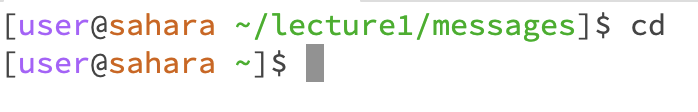

*cd - No Arguments*
- 
- The working directory is /home/lecture1/messages
- I got this output since I provided no argument so it assumed the home directory
- This output is not an error

*cd - Directory*
- 
- THe working directory this command was run was /home
- I got this output because I provided the path to the directory I wanted to be my working directory
- It is not an error 

*cd - File*
- 
- The working directory is /home/lecture1
- I got this output because I provided a file as an argument which is not a directory so cd will not work
- This output is an error because you cannot cd into a file.

*ls - No Arugments*
- 
- The working directory is /home
- I got this output because I provided no arguments so it assumes I am refering to the working directory and shows me its contents
- This output is not an error

*ls - Directory*
- 
- The working directory is /home
- I got this output because I provided a directory so it showed me the contents of that specific directory
- This output is not an error

*ls - File*
- 
- The working directory is /home/lecture1
- I got this output because I provided the file as an argument, since it is not a directory it just showed the current file
- This output is not an error

*cat - No Arguments*
- 
- The working directory is home/lecture1
- I got this output because I provided no argument to cat so it never provides an output
- This is an error because it froze and you cannot cat with no arguments.

*cat - Directory*
- 
- The working directory is home/lecture1
- I got this output because you can't cat into a directory
- This is an error because you cannot cat into a directory

*cat - File*
- 
- THe working directory is home/lecture1
- I got this output because you can cat into a file and it showed me the content of this file
- This is not an error

  

